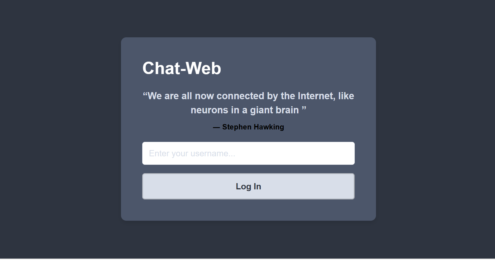
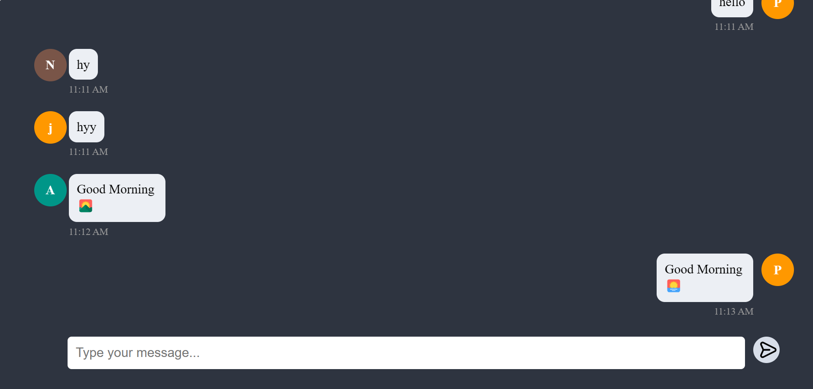
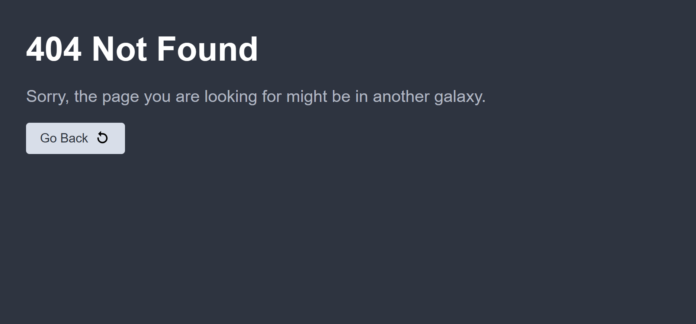

# ChatWeb

ChatWeb is an Angular application that provides a chat functionality. It includes modules for user authentication and chatting.

## Routes

- **`/login`**: Route for user authentication.

- **`/chat-window`**: Route for the chat functionality.

- Any other routes: Not Found Page

## Getting Started

Follow these steps to get the project up and running on your local machine:

1. Clone the repository: `git clone https://github.com/Nitesh058Raj/Chat-web.git`
2. Navigate to the project directory: `cd ChatWeb`
3. Install dependencies: `yarn install`
4. Start the development server: `yarn start`
5. Open your browser and visit `http://localhost:5223/`

## Development Server

Run `yarn start-prod` for a dev server. Navigate to `http://localhost:5223/`. The app will automatically reload if you change any of the source files.

## Build

Run `yarn build` to build the project. The build artifacts will be stored in the `dist/` directory. Use the `yarn build-prod` for a production build.

## Running Unit Tests

Run `yarn test` to execute the unit tests via [Karma](https://karma-runner.github.io).

## Project Structure

The project structure is organized as follows:

- **`/src`**: Contains the source code for the Angular application.
  - **`/src/app`**: Main application code.
    - **`/src/app/guards`**: Contains the route guard for user authentication.
      - `auth.guard.ts`: Implements a route guard to check user authentication.
    - **`/src/app/chat-web`**: Module for chat functionality.
      - **`/src/app/chat-web/components`**: Components related to chat functionality.
        - **`/src/app/chat-web/components/chat-window`**: Component for displaying chat window.
          - `chat-window.component.html`: HTML template for the chat window.
          - `chat-window.component.scss`: Styling for the chat window.
          - `chat-window.component.spec.ts`: Unit tests for the chat window component.
          - `chat-window.component.ts`: TypeScript code for the chat window component.
        - **`/src/app/chat-web/components/user-avatar`**: Component for displaying user avatars.
          - `user-avatar.component.html`: HTML template for user avatar.
          - `user-avatar.component.scss`: Styling for user avatar.
          - `user-avatar.component.spec.ts`: Unit tests for user avatar component.
          - `user-avatar.component.ts`: TypeScript code for user avatar component.
      - **`/src/app/chat-web/interfaces`**: Interfaces related to chat functionality.
        - `chat-web.model.ts`: Interface for chat messages.
      - **`/src/app/chat-web/services`**: Services related to chat functionality.
        - `web-socket-service.service.ts`: Service for handling WebSocket communication.
      - `chat-web-routing.module.ts`: Routing module for the chat module.
      - `chat-web.component.html`: HTML template for the chat web component.
      - `chat-web.component.scss`: Styling for the chat web component.
      - `chat-web.component.spec.ts`: Unit tests for the chat web component.
      - `chat-web.component.ts`: TypeScript code for the chat web component.
      - `chat-web.module.ts`: Module file for chat web module.
    - **`/src/app/login`**: Module for user authentication.
      - `login.component.html`: HTML template for the login component.
      - `login.component.scss`: Styling for the login component.
      - `login.component.spec.ts`: Unit tests for the login component.
      - `login.component.ts`: TypeScript code for the login component.
      - `login-routing.module.ts`: Routing module for the login module.
      - `login.module.ts`: Module file for the login module.
    - **`/src/app/shared`**: Shared code among different modules.
      - **`/src/app/shared/components`**: Shared components.
        - **`/src/app/shared/components/not-found`**: Component for handling 404 errors.
          - `not-found.component.html`: HTML template for the 404 component.
          - `not-found.component.scss`: Styling for the 404 component.
          - `not-found.component.spec.ts`: Unit tests for the 404 component.
          - `not-found.component.ts`: TypeScript code for the 404 component.
      - **`/src/app/shared/interfaces`**: Shared interfaces.
        - `shared.model.ts`: Interface for user details.
      - **`/src/app/shared/services`**: Shared services.
        - `user.service.ts`: Service for managing user details and authentication status.
      - `shared.module.ts`: Module file for shared components, interfaces, and services.
    - `app-routing.module.ts`: Routing configuration for the entire application.
    - `app.component.html`: Main HTML template for the application.
    - `app.component.scss`: Styling for the main application component.
    - `app.component.spec.ts`: Unit tests for the main application component.
    - `app.component.ts`: TypeScript code for the main application component.
    - `app.module.ts`: Module file for the entire application.
  - **`/src/assets`**: Contains static assets used in the application.
    - **`/src/assets/icons`**: SVG icons used in the application.
  - **`/src/environments`**: Configuration files for different environments.
    - `environment.prod.ts`: Production environment configuration.
    - `environment.ts`: Development environment configuration.
  - **`/src/styles`**: Global styles for the application.
    - `_colors.scss`: SCSS file defining color variables used in the application.
  - `favicon.ico`: Favicon for the application.
  - `index.html`: Main HTML file for the Angular application.
  - `main.ts`: Entry point for the Angular application.
  - `polyfills.ts`: Polyfills required by Angular.
  - `styles.scss`: Main SCSS file for styling the application.
  - `test.ts`: Entry point for unit tests.
- `angular.json`: Angular CLI configuration file.
- `browserslist`: Browserslist configuration for compatibility.
- `karma.conf.js`: Configuration file for Karma test runner.
- `package.json`: Node.js package configuration file.
- `README.md`: Project documentation (you are reading it right now).
- `LICENSE`: License file.
- `tsconfig.app.json`: TypeScript configuration for the Angular application.
- `tsconfig.json`: Main TypeScript configuration.
- `tsconfig.spec.json`: TypeScript configuration for unit tests.
- `yarn.lock`: Yarn lockfile.

## Contributing

We welcome contributions from the community. If you'd like to contribute to the project, please follow these steps:

1. Fork the repository.
2. Create a new branch for your feature or bug fix.
3. Make your changes and commit them.
4. Push your changes to your fork.
5. Submit a pull request to the main repository.

## Further Help

For more information about Angular and its features, check out the [Angular Documentation](https://angular.io/docs).

## Backend Repository

For the backend part of this project, including a Node.js Express server with WebSocket and KafkaJS integration, please refer to the [Backend Repository](https://github.com/Nitesh058Raj/Chat-Web_BE) for more details.

## License

This project is licensed under the MIT License - see the [LICENSE](LICENSE) file for details.
